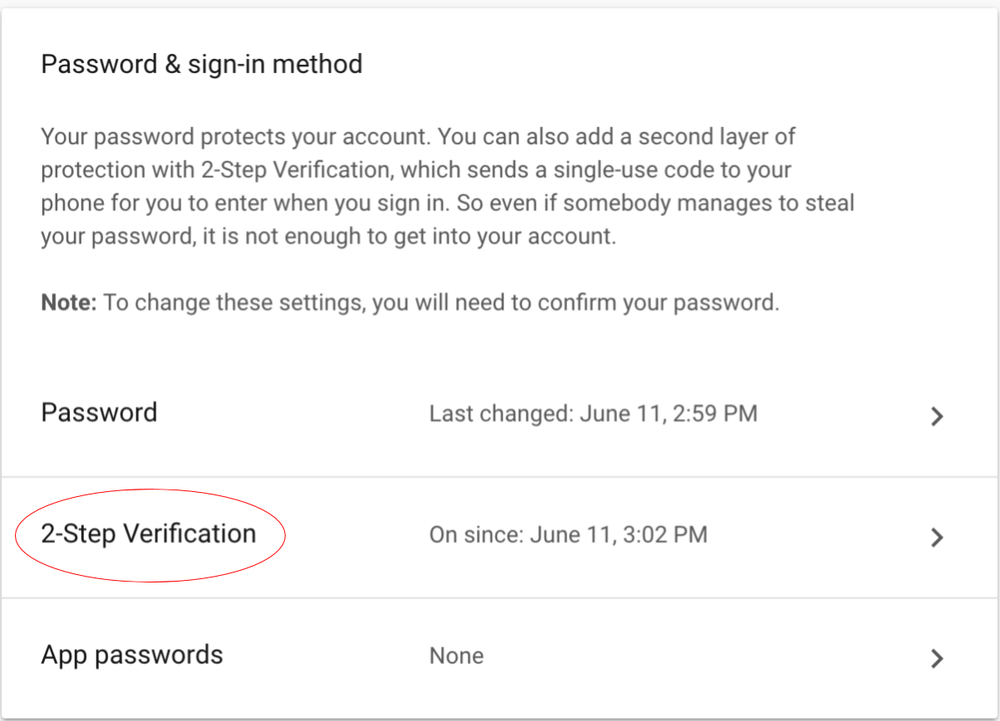
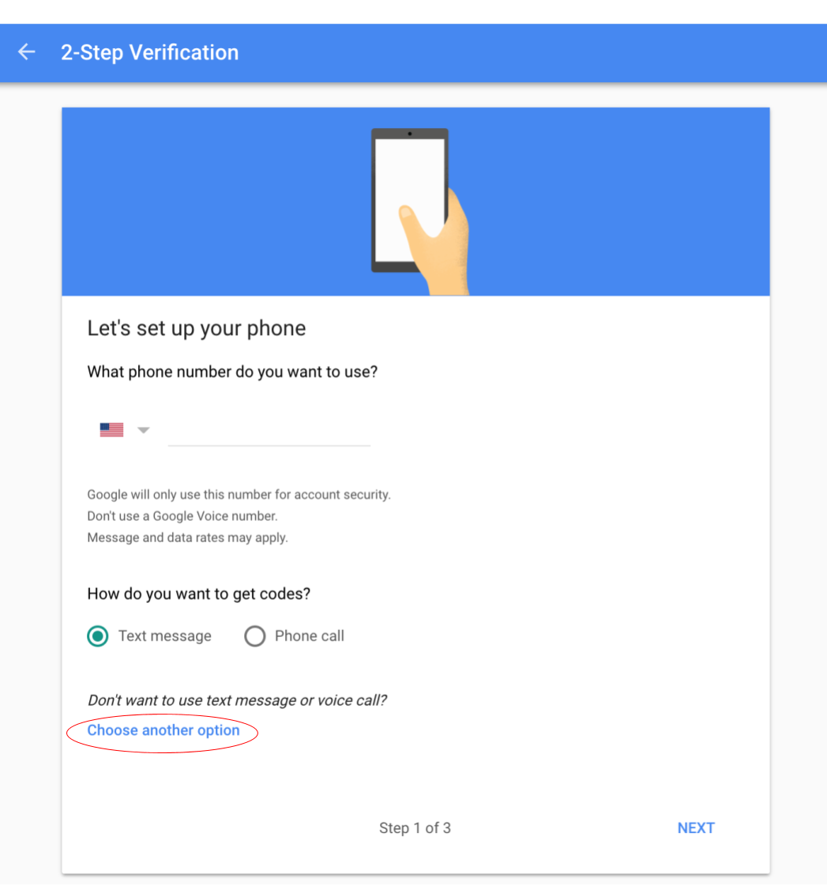
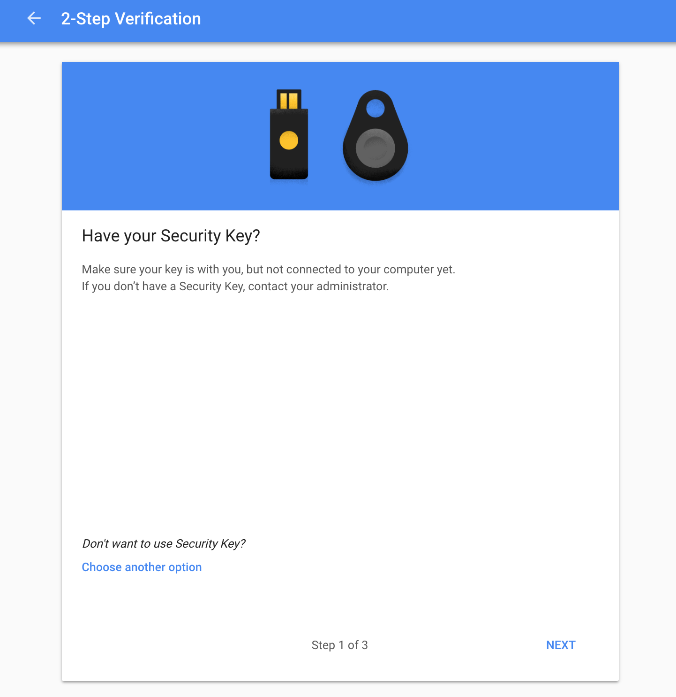
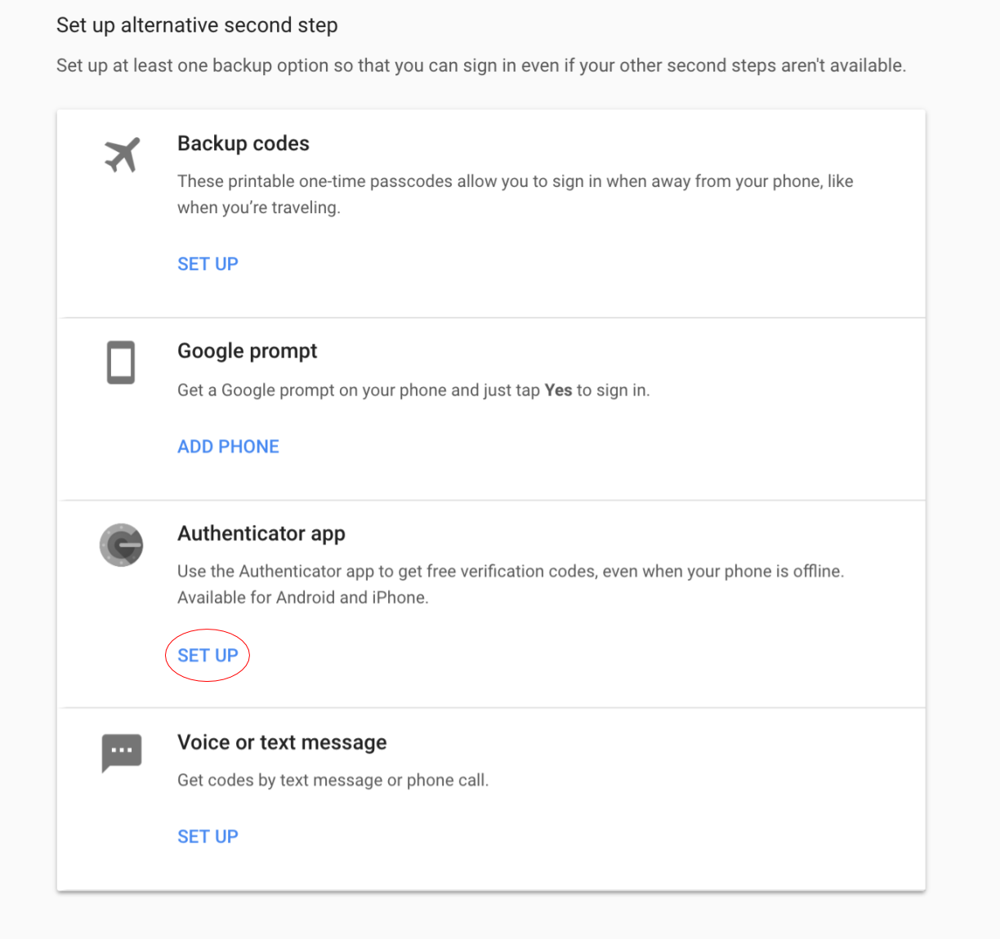

Enabling 2FA for your Gmail account with Yubikeys

Created by Landfish - aka Jeffrey Ladish

This tutorial explains how to configure your account with two security keys and an authenticator app. This is the highest form of Gmail security unless you want to go all the way and sign up for Google’s [Advanced Protection](https://landing.google.com/advancedprotection/) program. (This program requires you to *only* use security keys for 2FA and currently only works in the chrome browser).

 After you complete this tutorial, in order to access your account for the first time on any device, you will need **both** your password **and** **one** of the following:

* Your primary security key

* Your backup security key

* Your authenticator code from an Authenticator app on your phone

# **How to get started**

Buy two security keys (yubikeys). These two keys can each be used as a second factor to access your account. One is a backup to leave at home in a secure place, and one is to carry with you.

If your computer has normal USB ports, you can buy two of the blue yubikeys for $20 each on [Amazon](https://www.amazon.com/Yubico-Security-Key-USB-Authentication/dp/B07BYSB7FK/ref=sr_1_3?s=pc&ie=UTF8&qid=1534802520&sr=1-3&keywords=yubikey).

If your computer has usb-c ports, like the newer macbooks do, then you might want to get one usb-a and one [usb-c yubikey](https://www.yubico.com/product/yubikey-4-series/#yubikey-4c). 

To get setup, navigate to google.com or gmail.com. Then click on the circle in the top right of your browser, and click on "Google Account".

Next, under Sign-in & Security, select "Signing in to Google"

You may see a screen asking you to update your backup number and email. Leave them blank, and select Done.

Select "Signing into Google"

Next, select "2-Step Verification"

Select "Choose another option". Text message isn't a very secure form of authentication, so we're going to use something better.

Select Security Key, and follow the instructions for adding a security key. Name it something like **MAIN**

Add your **second** security key. Name it something like **BACKUP**

You should now see both keys under "Your second step":

Now, scroll down to the section labeled "Set up alternative second step"

Select "Authenticator app" and follow the instructions when prompted.

Download Google Authenticator from the[ Android app store](https://play.google.com/store/apps/details?id=com.google.android.apps.authenticator2&hl=en_US) or the[ Apple app store](https://itunes.apple.com/us/app/google-authenticator/id388497605?mt=8). 
 

When you’re done, you should have 2 security keys and the authenticator app listed under "Your second step." 

# **How will this affect my day to day?**

Whenever you log into your Gmail account on a **laptop computer **for the first time, you will need to enter both your **password** and your **security key** (yubikey). If you trust the computer you're signed into, you can have your account remember you (this is usually the default). You will only need to use your hardware key with that occasionally if you log out of that account and and then need to log back in.

Whenever you log into Gmail from a **phone** for the first time, you will need to enter your **password** and **the code from your authenticator app**. Once you're logged in, you should only need to use the code from your authenticator app very infrequently.

# **Why should I do this?**

For most people, their primary Gmail account is the biggest point of failure, since they’ve used this account to register many other services. If you need to reset your account password on these services, you can usually do this by email. This means that anyone who can access your Gmail account can also take over many of your other accounts. 

# **Do security keys offer better protection than an authenticator app?**

Much better. Security keys communicate with your browser, and will only give your code to the website where you created that code. An authenticator app relies on you, the human, to correctly identify the website, which can be hard with convincing fakes. Google has not had a single known case of a successful phishing attack since early 2017, when they started requiring that all employees use security keys.

[Google: Security Keys Neutralized Employee Phishing — Krebs on Security](https://krebsonsecurity.com/2018/07/google-security-keys-neutralized-employee-phishing/)

To read more about how Phishing works, check out this report by Stripe's security team:

[Ichthyology: Phishing as a Science](https://www.blackhat.com/docs/us-17/wednesday/us-17-Burnett-Ichthyology-Phishing-As-A-Science-wp.pdf)

# **[What should I do with my security keys**?](https://www.blackhat.com/docs/us-17/wednesday/us-17-Burnett-Ichthyology-Phishing-As-A-Science-wp.pdf)

I recommend keeping one on your key ring so you always have it (if you always have your keys on you. If not put it on something you *do* always have on you). Put the other one somewhere safe, like with your passport. The second one is a backup -- you should never carry it with your primary key. Part of the point of having two security keys is that if you lose your phone and your keys at the same time, you won’t be locked out of your account, because you will still have a backup key at home.

